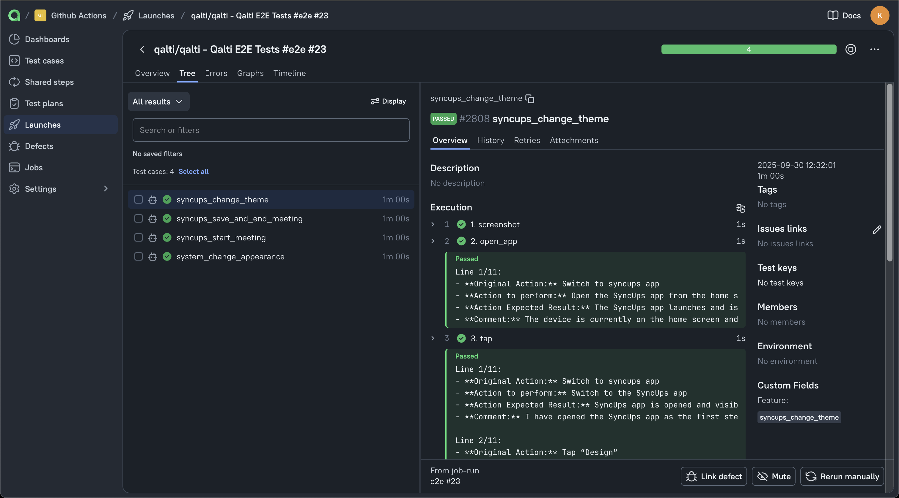

<div align="center">
  <a href="https://qalti.com/"></a>
  <h1>Qalti E2E Test CI Demo</h1>
  <p>
    This repository is a minimal demo showing how to run the Qalti CLI in a CI pipeline (GitHub Actions).
    It includes parallel simulator runs and an example of running a test on a real iOS device.
  </p>
  <br/>
  <p>Below is how a real CI run from this repository looks like under the hood with 4 workers:</p>
  <a href="https://qalti.com/"></a>
</div>

---

## What you can do 
- Parallel simulator execution
- Run tests on a real device
- Produce Allure-formatted reports that you can upload to any QA system

## Install Qalti

Qalti is a macOS app, and the CLI is included in the bundle. You can go to [qalti.com](https://qalti.com/) to download and install the latest release, or just run this bash script:

```bash
curl -L -o Qalti.dmg https://app.qalti.com/releases/Qalti-0.5.5.dmg
hdiutil attach Qalti.dmg -nobrowse -quiet -mountpoint /Volumes/Qalti
cp -R /Volumes/Qalti/Qalti.app /Applications/Qalti.app
hdiutil detach /Volumes/Qalti -quiet

# Run the CLI directly from the app bundle
/Applications/Qalti.app/Contents/MacOS/Qalti cli --help
/Applications/Qalti.app/Contents/Resources/QaltiScheduler --help
```

## Minimal CLI example
This is the easiest way to run your test:
```bash
/Applications/Qalti.app/Contents/MacOS/Qalti change_appearance.test
```

where `change_appearance.test` is a test file with steps in English:

```
Open Settings
Scroll down to find Display & Brightness
Tap it
Change Appearance
Verify Appearance is changed
```

To learn more, run `/Applications/Qalti.app/Contents/MacOS/Qalti cli --help`


## CI example (GitHub Actions)
- This workflow example shows how you can use Qalti in your CI pipelines: [`.github/workflows/qalti.yml`](.github/workflows/qalti.yml) — it’s short, commented, and shows how to:
  - Set up Qalti
  - Run tests on simulators and on a real device
  - Export Allure results and upload artifacts

You can check the [Qalti CI run](https://github.com/qalti/qalti/actions/runs/18176495891/job/51743490923) to see it in action.

## Allure reports
Qalti outputs results in Allure format if you set the `--allure-dir` flag. You can upload them to your QA system of choice. As an example, we use TestOps Cloud and upload via `allurectl`.



## Contact

- If you need access to the CLI, let us know: [hi@qalti.com](mailto:hi@qalti.com)
- Qalti website: [qalti.com](https://qalti.com/)

