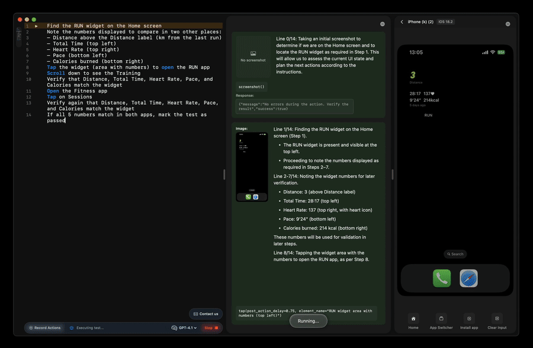
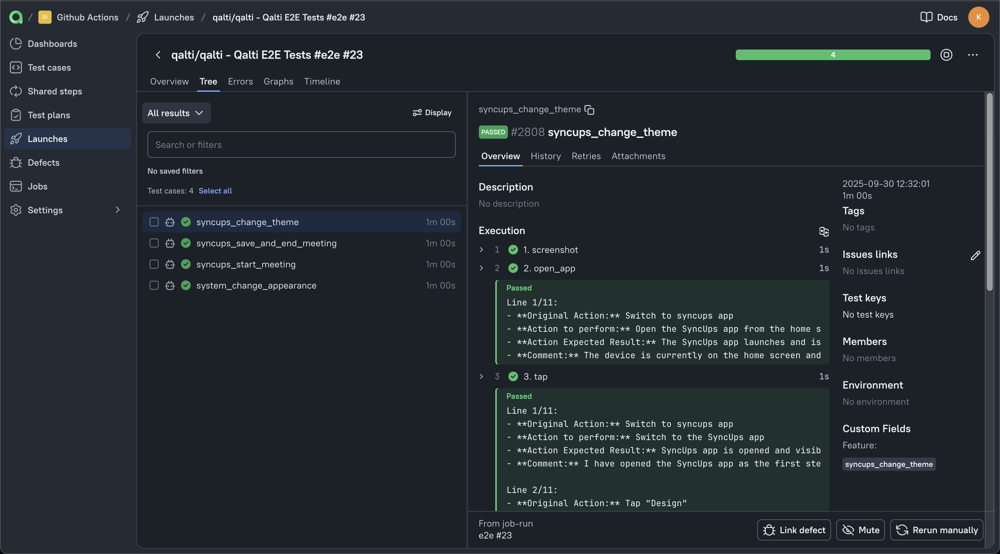

<div align="center">
  <a href="https://qalti.com/"></a>
  <h1>AIQA (Qalti)</h1>
  <p>
    AIQA is an AI agent for mobile app testing.
    It visually inspects your app and interacts with it like a user: tapping buttons, entering text, scrolling, and opening links.
  </p>
  <p>
    You write tests in plain English.
    AIQA executes them on iOS Simulator or connected devices and produces step-by-step logs with screenshots.
  </p>
  
</div>

---

## Quick start

- **Route A - install prebuilt app (no source build)**
  - Install Qalti:

    ```bash
    curl -L -o Qalti.dmg https://app.qalti.com/releases/Qalti.dmg
    hdiutil attach Qalti.dmg -nobrowse -quiet -mountpoint /Volumes/Qalti
    cp -R /Volumes/Qalti/Qalti.app /Applications/Qalti.app
    hdiutil detach /Volumes/Qalti -quiet
    ```

  - Launch `Qalti` from Applications.
  - Add your OpenRouter API key in Settings.
  - Run one of the sample scenarios from `tests/` against your app or the SyncUps demo app.

- **Route B - automated source build (recommended for developers)**

  ```bash
  git clone <repository-url>
  cd aiqa
  make first-run
  ```
  
  See [Build from Source](#build-from-source) for details and additional commands.

- **Route C - manual source build**
  - Follow `DEVELOPER.md` for the detailed clean-machine setup flow with checkpoints.
  - Build and run manually from `xcodeproject/Qalti.xcodeproj`.

Access expectations:

- UI and CLI execution require your own OpenRouter API key.
- For CLI and CI, set `OPENROUTER_API_KEY` (or pass `--token <OPENROUTER_API_KEY>`).

## What You Can Achieve

- Run zero-code UI tests on iOS Simulator.
- Run the same tests on connected iPhone and iPad devices.
- Execute test suites in parallel with `QaltiScheduler`.
- Export Allure-compatible results for QA dashboards.
- Test app flows across boundaries (for example app -> deep link -> another app).

## How It Works

AIQA runs a perception-action loop on the real rendered UI:

- **View** - capture and understand the current screen.
- **Decide** - choose the next best action toward the test goal.
- **Act** - perform tap, type, scroll, open app, or open URL actions.
- **Verify** - compare the visible state with expected assertions.
- **Repeat** - continue until the scenario is complete.

This black-box approach does not require source code hooks or UI hierarchy access.

## Build from Source

Prerequisites:

- macOS
- Xcode 16.4+
- Python 3.x

**Recommended - Automated Build:**

```bash
make build        # Full build with code formatting and linting
make build-fast   # Fast incremental build (most common during development)
make first-run    # First-time setup with permission guidance
```

The Makefile automation handles:

- Python virtual environment setup
- Code formatting (black) and linting (flake8)
- xcpretty/xcbeautify tool installation
- macOS permission troubleshooting
- App building and launching

**Alternative - Manual Build:**

Build the simulator runner dependency once before your first local build:

```bash
cd xcodeproject
bash ./scripts/archive_simulator_runner.sh
```

Then build and run `Qalti` from `xcodeproject/Qalti.xcodeproj`.

For detailed manual setup, see `DEVELOPER.md`.

**CLI Usage:**

CLI binaries are inside the `Qalti.app` bundle (source build output or `/Applications` install):

```bash
<PATH_TO_QALTI_APP>/Contents/MacOS/Qalti cli --help
<PATH_TO_QALTI_APP>/Contents/Resources/QaltiScheduler --help
```

Running tests from CLI requires an OpenRouter API key and an app build path.
Use `DEVELOPER.md` for the full source-build + first-test flow.

## CI

Use [`.github/workflows/qalti.yml`](./.github/workflows/qalti.yml) as the baseline public workflow.
It demonstrates:

- runner setup via [`scripts/setup_runner.sh`](./scripts/setup_runner.sh)
- parallel simulator runs via `QaltiScheduler`
- optional real-device run
- optional Allure upload and report artifact publishing

CI preview (4 tests running in parallel):


## Allure Reports

AIQA can emit Allure-compatible results through the `--allure-dir` flag.
The workflow above shows one way to upload them after execution.



## Example Tests

Sample plain-text tests are in `tests/`:
The `syncups_*` scenarios target the open-source SyncUps app: <https://github.com/pointfreeco/syncups>

- [`tests/system_change_appearance.test`](./tests/system_change_appearance.test)
- [`tests/syncups_change_theme.test`](./tests/syncups_change_theme.test)
- [`tests/syncups_start_meeting.test`](./tests/syncups_start_meeting.test)
- [`tests/syncups_save_and_end_meeting.test`](./tests/syncups_save_and_end_meeting.test)

## Project Layout

- `xcodeproject/` - macOS app, scheduler, iOS runner targets, Xcode project, and packaging assets.
- `tests/` - example `.test` scenarios for local and CI runs.
- `scripts/` - public helper scripts for CI setup.
- `.github/workflows/` - GitHub Actions workflow examples.
- `DEVELOPER.md` - source build workflow and Xcode setup notes.

## Documentation

- Docs portal: <https://docs.qalti.com/>
- Install guide: <https://docs.qalti.com/getting-started/install>
- First test guide: <https://docs.qalti.com/getting-started/first-test>
- CI quickstart: <https://docs.qalti.com/getting-started/ci-quickstart>
- Website: <https://qalti.com/>

## License

MIT. See `LICENSE`.
